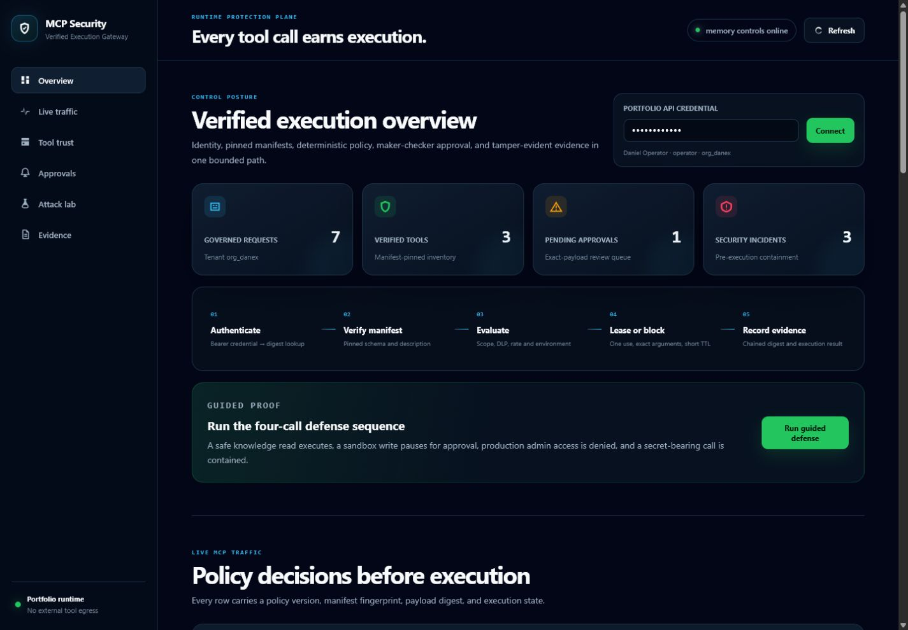
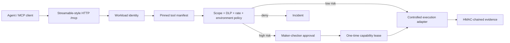

# MCP Security Gateway

> Protocol-aware runtime firewall for verified MCP tool execution.

[](https://github.com/danieloza/mcp-security-gateway/actions/workflows/ci.yml)


[Overview](#what-it-solves) · [Verified Execution](#verified-execution-flow) · [Demo](#guided-demo) · [API](docs/API_EXAMPLES.md) · [Threat Model](docs/THREAT_MODEL.md) · [Patch Notes](CHANGELOG.md)



## What It Solves

Agents can discover powerful MCP tools, but discovery is not authorization. A
production control point must determine:

- which workload and tenant initiated the call;
- whether the server, tool description, and JSON schema still match an approved
  manifest;
- whether the requested scope and arguments fit policy;
- whether secrets or forbidden destinations appear in the call;
- whether a human must approve the exact payload;
- whether the approved call was modified, replayed, or executed twice;
- what evidence proves the final outcome.

MCP Security Gateway places that control point between an MCP client and a fixed
tool execution adapter. It supports protocol-level `initialize`, `ping`,
`tools/list`, and `tools/call`, then applies deterministic controls before any
side effect.

## Verified Execution Flow



Every governed request records:

- random, non-enumerable identifiers;
- tenant, workload, server, tool, scope, and policy version;
- SHA-256 argument, manifest, and governed-request digests;
- a redacted argument representation;
- the policy trace and decision reason;
- approval actor, lease expiry, execution result digest, and audit-chain events.

## Security Capabilities

### API key hygiene

- raw credentials are accepted only at the request boundary;
- SQLite stores SHA-256 digests, never recoverable API-key values;
- legacy plaintext demo rows are migrated to digest-only storage;
- API responses never expose credential material;
- Redis rate-limit keys use an opaque subject digest rather than the credential;
- production mode refuses an in-memory rate-limit fallback.

The values in [Demo credentials](#demo-credentials) are intentionally public
portfolio credentials, not secrets. They exist only to make the local walkthrough
repeatable.

### Tool Manifest Trust

Tool names, descriptions, JSON schemas, required scopes, risk levels, and
annotations are fingerprinted. Candidate changes produce a field-level diff.
Security administrators can quarantine a drifted tool; a platform administrator
must explicitly restore its trust state.

MCP tool annotations are retained for interoperability and operator context, but
the gateway does not treat server-provided hints as authorization.

### Approval-bound capability leases

High-risk calls are held before execution. An approved call receives a random,
short-lived, one-use lease bound to:

- tenant and requesting workload;
- server, tool, scope, and policy version;
- approved manifest digest;
- exact argument digest;
- complete governed-request digest.

Changing the path, payload, tool schema, caller, or policy context invalidates
execution. Reusing the lease is rejected.

### MCP Attack Lab

The operator console runs deterministic checks for:

- tool-description rug pull / manifest drift;
- argument substitution after approval;
- secret-bearing tool arguments;
- cloud-metadata SSRF destinations;
- plaintext API-key persistence.

## Operator Console

The dashboard provides:

- live MCP policy and execution traffic;
- tool trust registry with manifest fingerprints;
- maker-checker approval workbench;
- one-time lease visibility without browser persistence;
- attack-lab results;
- request evidence timeline and chain-integrity status;
- a four-call guided defense sequence for portfolio presentations.

The UI keeps the entered credential only in JavaScript memory. It does not use
cookies or browser storage.

## API Surface

### MCP protocol boundary

- `POST /mcp` — `initialize`, `ping`, `tools/list`, and `tools/call`

### Operator API

- `GET /health`
- `GET /me`
- `GET /mcp-servers`
- `GET /policies`
- `GET /tool-registry`
- `POST /tool-registry/{tool_id}/verify`
- `POST /tool-registry/{tool_id}/restore`
- `GET /requests`
- `GET /requests/{request_id}`
- `POST /requests`
- `GET /approvals`
- `POST /approvals/{approval_id}/decision`
- `POST /requests/{request_id}/execute`
- `GET /requests/{request_id}/evidence`
- `GET /incidents`
- `POST /attack-lab/run`

See [API examples](docs/API_EXAMPLES.md) for protocol and approval flows.

## Run Locally

```powershell
git clone https://github.com/danieloza/mcp-security-gateway.git
cd mcp-security-gateway

python -m venv .venv
.\.venv\Scripts\Activate.ps1
python -m pip install -e ".[dev]"
python -m uvicorn mcp_security_gateway.main:app --reload --host 127.0.0.1 --port 8000
```

Open:

- operator console: `http://127.0.0.1:8000/dashboard`
- local API documentation: `http://127.0.0.1:8000/docs`

Interactive API documentation is disabled automatically when
`MSG_ENVIRONMENT=production`.

## Demo Credentials

These credentials are public, local-only portfolio fixtures:

```text
operator:       msg-ops-demo
security admin: msg-security-demo
platform admin: msg-platform-demo
```

Use the preferred header:

```http
Authorization: Bearer msg-ops-demo
```

`X-API-Key` remains available for backward-compatible local examples, but new
integrations should use the Bearer transport. Real deployments must replace
these fixtures with workload identity or an organizational authorization
service.

## Guided Demo

1. Open the operator console.
2. Connect as `msg-ops-demo`.
3. Run **Guided defense**:
   - `kb.search` is verified and executed;
   - `repo.write_file` is held for approval;
   - `ops.restart_service` is hard-blocked;
   - a Bearer-like value inside arguments is redacted and contained.
4. Switch to `msg-security-demo`.
5. Approve the exact sandbox-write payload and run the Attack Lab.
6. Switch back to `msg-ops-demo`.
7. Execute the one-time lease and open its evidence timeline.
8. In Tool Trust, simulate a changed tool description and show the manifest
   drift result.

The full presenter script is in [docs/DEMO_GUIDE.md](docs/DEMO_GUIDE.md).

## Docker Compose

```powershell
docker compose config --quiet
docker compose up --build
```

Compose binds the API to loopback, keeps Redis on the internal network, drops
Linux capabilities, uses a non-root application user, and mounts only the
persistent SQLite data volume. The local fallback audit key remains a
development convenience; configure a managed secret for any non-local runtime.

## Testing

```powershell
python -m pip install -e ".[dev]"
python -m pytest -q
python -m pip_audit .
docker compose config --quiet
```

The suite covers key migration, credential response shaping, MCP negotiation,
verified low-risk execution, maker-checker separation, argument-bound leases,
lease replay, manifest quarantine, DLP blocking, tenant isolation, Origin
validation, strict request schemas, evidence integrity, and dashboard headers.

## Production-shaped, Not Production-ready

This repository proves the security control path. It intentionally does not
claim to be a drop-in enterprise gateway.

Current portfolio boundaries:

- SQLite persistence rather than managed PostgreSQL and migrations;
- public local demo credentials rather than corporate workload identity;
- a fixed in-process execution adapter rather than arbitrary remote MCP server
  registration;
- no unrestricted outbound HTTP, filesystem, shell, or production operations;
- local HMAC evidence integrity without external timestamping or immutable
  archival;
- single-node operator workflow without organizational incident ownership.

A company rollout would add OAuth 2.1 resource-server validation, managed secrets
and key rotation, PostgreSQL, durable queues, network egress policy, a controlled
server onboarding process, signed manifest releases, centralized telemetry,
backups, incident response, and independent audit retention.

See [Threat Model](docs/THREAT_MODEL.md) and
[Architecture](docs/ARCHITECTURE.md).

## Proof Assets

- operator dashboard: [docs/assets/gateway-dashboard.png](docs/assets/gateway-dashboard.png)
- architecture: [docs/ARCHITECTURE.md](docs/ARCHITECTURE.md)
- threat model: [docs/THREAT_MODEL.md](docs/THREAT_MODEL.md)
- API examples: [docs/API_EXAMPLES.md](docs/API_EXAMPLES.md)
- guided demo: [docs/DEMO_GUIDE.md](docs/DEMO_GUIDE.md)
- case study: [docs/CASE_STUDY.md](docs/CASE_STUDY.md)
- patch notes: [CHANGELOG.md](CHANGELOG.md)

## Interview Framing

> I built a protocol-aware MCP enforcement point rather than trusting the agent
> or the tool server. Every call is tied to workload identity, a pinned tool
> manifest, versioned policy, and an exact argument digest. Risky calls receive a
> one-time approval lease, while manifest drift, secret egress, scope escalation,
> and production operations are contained before execution.

## Related Project

[Regulated AI Agent Platform](https://github.com/danieloza/regulated-ai-agent-platform)
demonstrates broader governance lifecycles. MCP Security Gateway stays deliberately
narrow: it is the protocol-specific enforcement boundary for agent tool traffic.
