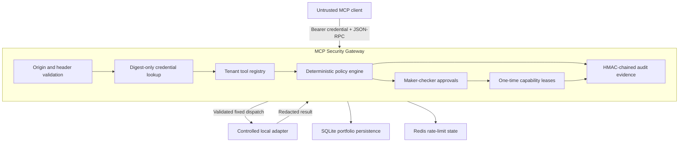

# Architecture

MCP Security Gateway is a protocol-aware enforcement point between an MCP client
and a fixed, controlled execution adapter.

## Trust Boundaries

The client, tool arguments, MCP tool descriptions, annotations, and results are
untrusted. The gateway's pinned manifest registry and deterministic policy are
authoritative for the portfolio runtime.

## MCP Boundary

`POST /mcp` supports:

- `initialize`;
- `ping`;
- `tools/list`;
- `tools/call`.

The transport validates:

- `Authorization: Bearer` credentials;
- an allowlisted browser `Origin`, when present;
- consistency between `Mcp-Method` / `Mcp-Name` headers and the JSON-RPC body;
- strict Pydantic envelopes and a bounded Content-Length;
- tenant membership before exposing server or tool inventory.

This is a deliberately bounded MCP protocol surface, not a transparent generic
proxy. Arbitrary target URLs and arbitrary server registration are not
supported.

## Decision Pipeline

1. Resolve the caller from the SHA-256 credential digest.
2. Bind the organization and actor to the request.
3. Load the registered server and pinned tool manifest.
4. Validate arguments against the stored JSON schema.
5. Apply fixed-window caller rate limits.
6. Detect secret-bearing values and forbidden network destinations.
7. Verify requested scope, server environment, and manifest trust state.
8. Select a versioned policy:
   - `pol_default_allow`;
   - `pol_approval_gate`;
   - `pol_hard_block`.
9. Persist the redacted arguments, digests, policy trace, and decision.
10. Execute, hold for approval, or create an incident.

## Approval and Execution Binding

A high-risk decision stores:

- SHA-256 argument digest;
- manifest digest;
- policy version;
- governed-request digest;
- maker identity.

The checker cannot be the maker. Approval generates a random token, while only
its digest is persisted. The capability lease is:

- valid for a short configured TTL;
- usable once;
- tenant and request bound;
- consumed atomically;
- rejected before consumption when the caller, arguments, manifest, or governed
  request digest differs.

The local execution adapter exposes two demonstrable behaviors:

- `kb.search` returns bounded internal knowledge results;
- `repo.write_file` stages metadata for an isolated portfolio sandbox without
  writing to the host filesystem.

`ops.restart_service` intentionally has no execution adapter and is hard-blocked.

## Evidence Integrity

Each audit event contains:

- organization, event type, subject, and actor;
- canonical redacted payload JSON;
- previous event digest;
- event HMAC digest;
- UTC timestamp.

Appending uses an immediate SQLite transaction so parallel events cannot select
the same chain head. Evidence export verifies the full organization chain before
returning the request-specific timeline and evidence-pack digest.

The HMAC key is a local development default unless configured. A production
design must load it from managed key storage, rotate it deliberately, and anchor
or archive evidence outside the primary database.

## Runtime Security Defaults

- Trusted Host validation;
- no CORS middleware by default;
- CSP, clickjacking, MIME-sniffing, referrer, and permissions headers;
- interactive API docs disabled in production mode;
- non-root container user;
- dropped Linux capabilities and no-new-privileges in Compose;
- Redis required in production;
- raw API credentials absent from database rows, API responses, and rate-limit
  keys.

## Scaling Boundary

SQLite and the local execution adapter are appropriate for a deterministic
portfolio walkthrough. Multi-replica operation would require PostgreSQL,
durable migrations, managed Redis, a queue or worker boundary, distributed
tracing, and a separately controlled upstream MCP connector service.
